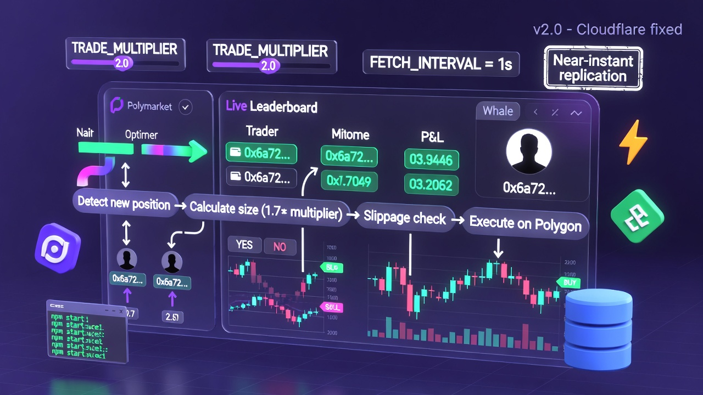

# Polymarket Copy Trading Bot

> Automated copy trading for Polymarket. Mirrors trades from top performers with smart position sizing and real-time execution.

## How It Works

1. **Select Traders** – Choose from [Polymarket leaderboard](https://polymarket.com/leaderboard) or [Predictfolio](https://predictfolio.com)
2. **Monitor** – Bot watches trader activity via Polymarket Data API
3. **Size** – Scales positions by your balance vs trader balance
4. **Execute** – Places matching orders on Polymarket
5. **Track** – Full history in MongoDB

## Quick Start

### Prerequisites

- Node.js v18+
- [MongoDB](https://www.mongodb.com/cloud/atlas/register) (Atlas free tier)
- Polygon wallet with USDC + POL for gas
- [RPC endpoint](https://infura.io) or [Alchemy](https://www.alchemy.com)

### Install

```bash
git clone https://github.com/dev-protocol/Polymarket_Copy_Trading_Bot_V2
cd Polymarket_Copy_Trading_Bot_V2
npm install
```

### Configure

**Option A – Setup wizard (recommended)**

```bash
npm run setup
```

**Option B – Manual**

```bash
cp .env.example .env
# Edit .env with your settings
```

### Run

```bash
npm run build
npm run health-check   # Verify config
npm start              # Start trading
```

## Commands

| Category | Command | Description |
|----------|---------|-------------|
| **Start** | `npm run setup` | Interactive config wizard |
| | `npm run health-check` | Verify configuration |
| | `npm run build` | Compile TypeScript |
| | `npm start` | Start trading bot |
| | `npm run dev` | Run in dev mode |
| **Wallet** | `npm run check-proxy` | Check wallet & positions |
| | `npm run check-allowance` | Verify USDC allowance |
| | `npm run set-token-allowance` | Set USDC spending approval |
| **Stats** | `npm run check-stats` | Trading statistics |
| | `npm run check-activity` | Recent activity |
| **Positions** | `npm run manual-sell` | Sell a position |
| | `npm run close-stale` | Close old positions |
| | `npm run redeem-resolved` | Redeem resolved markets |
| **Traders** | `npm run find-traders` | Find best traders |
| | `npm run find-low-risk` | Low-risk traders |
| **Simulate** | `npm run simulate` | Backtest strategy |
| **Help** | `npm run help` | List all commands |

## Configuration

| Variable | Description | Default |
|----------|-------------|---------|
| `USER_ADDRESSES` | Traders to copy (comma-separated) | — |
| `PROXY_WALLET` | Your Polygon wallet | — |
| `PRIVATE_KEY` | Wallet private key (no 0x) | — |
| `MONGO_URI` | MongoDB connection string | — |
| `RPC_URL` | Polygon RPC endpoint | — |
| `FETCH_INTERVAL` | Monitor interval (seconds) | 1 |
| `EXECUTOR_INTERVAL_MS` | Trade check interval (ms) | 300 |
| `COPY_STRATEGY` | PERCENTAGE, FIXED, or ADAPTIVE | PERCENTAGE |
| `COPY_SIZE` | Copy % or fixed $ | 10.0 |
| `MAX_ORDER_SIZE_USD` | Per-trade cap | 100.0 |

See [.env.example](.env.example) for full options.

## Features

- **Multi-Trader** – Copy multiple traders at once
- **Position Sizing** – Balance-based scaling
- **Tiered Multipliers** – Different multipliers by trade size
- **Trade Aggregation** – Combine small trades above $1 minimum
- **Real-time** – 1s monitor + 300ms executor (configurable)

## Docs

- [Getting Started](docs/GETTING_STARTED.md)
- [Quick Start](docs/QUICK_START.md)
- [Multi-Trader Guide](docs/MULTI_TRADER_GUIDE.md)
- [Tiered Multipliers](docs/TIERED_MULTIPLIERS.md)

## License

MIT – See [LICENSE](LICENSE.md)

**Disclaimer:** For educational use only. Trading carries risk. Not responsible for financial losses.
